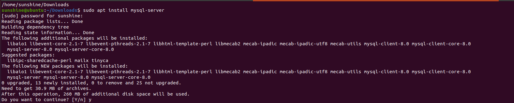
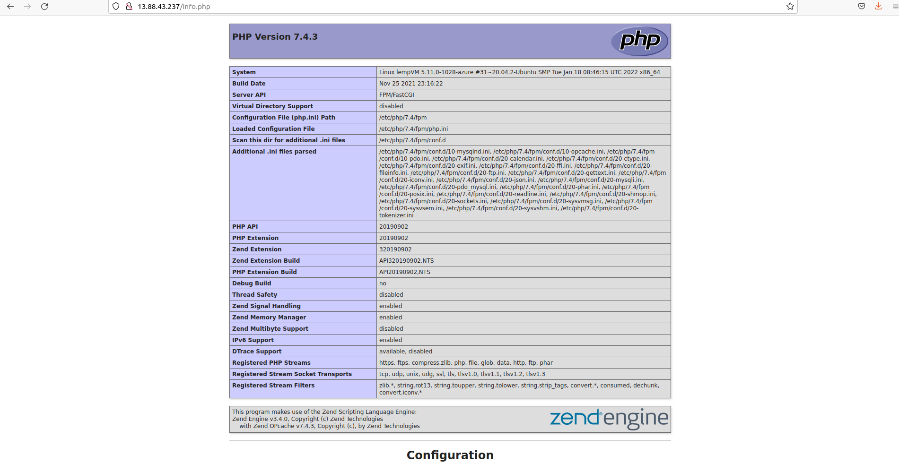

# web-stack-implementation-lemp
a new repo for lemp project

Howdy ya'll,welcome to the Web Stack Implementation using LEMP Stack in Azure project.

In this project, we will be using the LEMP stack! You may be wondering, what is LEMP?

    L stands for Linux Operating system
    E stands for Nginx web server (pronounced as engine-x, hence the E in the acronym)
    M stands for MySQL database
    P stands for PHP scripting language.

Here is a brief description of each component:

Linux is an operating system that manages the underlying hardware on your PC. It is an open-source software that is used worldwide and there are many distributions of it (e.g. Ubuntu, CentOS, etc). It is flexible and easy to configure.

Nginx is an HTTP proxy application that can deliver high performance by handling an increased load of HTTP requests (especially compared to Apache).

MySQL is an open-source relational database management system.

PHP is a scripting language on the server-side used for the creation of static or dynamic web sites or Web applications.

Now that you know the components that we're using, let's get started!

# Linux
Setting up your virtual environment on Azure portal

In order to complete this project, it is necessary to set up a virtual environment using Azure. In case you are not familiar with Azure, don't worry! It is user-friendly and I will guide you along the way!

Microsoft Azure is one of the major Cloud Service Providers in the world. Azure offers a wide variety of databases and services for different types of applications. This allows users to choose the right tool for the job while receiving the best cost and performance.

Fortunately, Azure offers a Free Tier for newly registered account users. This enables users to try out some Azure services free of charge for alimited peroid. For this project, we will utilize the VM, which is covered by the Free Tier!

Let's begin by setting up a virtual environment. First, create a free account on Azure. Once you have created your account, sign in using your credentials.

once you log in into the azure portal, click VM and choose the create a new VM option from the dropdown menu.
nest choose a subscription name for the VM. also dont forget to choose which resource groups you add to the VM. 
give your VM a name, and for the regions I'll choose the regions closest to me which in this case will be the US West region. 
since we'll be using the Ubuntu OS, i'll go ahead and select the Ubuntu server 20.04 LTS-Gen 2 image. once i do that the size will be pre-selected and I will it that way.
Everything else will be pre-selected by the defualt and I'll leave it that way.

Now, since i won't be making any more changes in the Disks, Networking, Mangement, Advanced, Tags, tabs I'll go ahead and click Review + Create in the bottom left of our page to begin creating of the VM.

After that is done with, I'll select Go to resources to view my newly created VM.

i'll ssh into the created VM, to do that i'll slect connect on the top left corner the resource page. select ssh from the options given

Connecting to your EC2 from your local PC

PLEASE NOTE Anchor tags < > will be used to indicate contents what must be replaced with your unique values. For example, if you have a file named keypair123.pem you must enter this information within the corresponding anchor tag:

Now let's connect to our instance!

Begin by opening Terminal. Once you have opened Terminal, use the cd command to change into the directory that your key pair is located. This is usually the ~/Downloads directory. If you are having difficulty finding it, you can use the ls command to list the contents of your current directory.

Once you have located the key pair, use the command below to activate the key pair file (.pem). This command will also change permissions (otherwise you may get the error “Bad Permissions”):

$ sudo chmod 0400 <private-key-name>.pem

When prompted, type the password for your local PC and press Enter on your keyboard.

Next, go back to the Azure resource page for a moment, and navigate to your running VM. Copy the Public IP address, as shown in the image below:

Now that you've copied the Public IP address, go back to Terminal. Connect to the EC2 instance by using the command below:

ssh -i <Your-private-key.pem> ubuntu@<EC2-Public-IP-address>

Next, you will be asked if you want to continue connecting. Type Yes and press Enter on your keyboard.

To verify that you are connected, you should see your IP address on the top-right of the screen. Nice job! You have successfully connected to your Linux server in the Cloud environment.

# Nginx Web Server
Installing Nginx on your virtual environment

As mentioned earlier, Nginx is a powerful web server! It will enable users to view displayed web pages. Let's begin by using Ubuntu’s package manager: apt. This command will check for any updates for the server’s package index:

$ sudo apt update

Next, run the following command to install Nginx:

$ sudo apt install nginx 

When prompted, enter Y to confirm that you want to install Nginx. Your Terminal may look something like this:

Once the installation is complete, the Nginx web server should be running on your Ubuntu 20.04 server. In order to verify that nginx was successfully installed and is running as a service in Ubuntu, run the following command:

$ sudo systemctl status nginx

If there is a green dot, then that means it's running! Nice work!

# Modifying the firewall

In order to receive traffic to our Web Server, it is imperative to open TCP port 80. This is the default port that web browsers utilize in order to access web pages on the Internet.

When we created a VM,the TCP port 22 was opened by default. This allowed us to access the VM via SSH in Terminal. However, we must add a rule to the security groups of our VM configuration, in order to allow inbound connections through port 80.

Begin by going to the network tap on the left and selecting it.

now select Add inbound port rule on the far right. select the Serive dropdown menu and select HTTP and Add save to save newly created port rule.

Now let's verify whether or not we can receive traffic. On the Terminal, use the following command to send a request our Nginx on port 80.

$ curl http://localhost:80 

You should see something like this:

Next, let's try to verify access through the web browser using the public IP address of the EC2 instance. Open a web browser of your choice and then enter the following url (remember to replace contents within the Anchor Tabs < >):

http://<Public-IP-Address>:80

You should see the following web page. This is the Nginx default page:

# MySQL
**Installing MySQL on your virtual environment**

Congratulations on setting up and running your Nginx web server. Next, we will install MySQL, which is an open-source relational database management system. This will allow us to store and manage data for the website.

Begin by using the following command to install MySQL:

$ sudo apt install mysql-server

Once the installation is complete, it is best practice to run a security script in order to add more security access to your database system. Use the following command:

$ sudo mysql_secure_installation

You will be asked to validate password component. Type Y for "Yes".

Next, you must choose the level of your password validation. There are three levels of password validation policy:

Please choose either 0 = LOW, 1 = MEDIUM or 2 = STRONG

Please Note: There are three levels of password validation policy:

LOW --- Length >= 8

MEDIUM --- Length >= 8, numeric, mixed case, **and** special characters

STRONG --- Length >= 8, numeric, mixed case, special characters **and** dictionary file

Once you are satisfied with your password, enter it then type Y for “Yes” when asked if you want to continue with the password provided.

For the rest of the questions, type Y for "Yes" and press Enter on your keyboard at each prompt.

These security measures will remove anonymous users and the test database, disable remote root logins, and then reload these new rules so that the changes will be reflected on the MySQL database.

Your Terminal should look something like this:

Next, you can check whether you can log in to the MySQL console by typing the following command. This command allows you to connect to the MySQL server as the administrative user (root user), which is implied by the use of 'sudo' part of the command:

$ sudo mysql

This will connect to the MySQL server as the administrative database user root, which is inferred by the use of sudo when running this command. You should see the following output:

# PHP 
**Installing PHP on your virtual environment**

Congrats on making it this far! We have reached the final component of the LEMP web stack; PHP is general-purpose scripting language which process code so that it can display dynamic content to the end user.

Nginx must have an external program to help manage PHP processing, while acting as the middleman between the PHP interpreter and the web server. This improves performance, however it requires additional configuration.

Therefore, we must install php-fpm, which is an acronym for PHP fastCGI process manager. We must also install php-mysql, which is a PHP module that helps PHP communicate with MySQL-based databases.

We can simultaneously install both of these packages. All we have to do is run the following command on Terminal:

$ sudo apt install php-fpm php-mysql

When prompted, type Y and press Enter to confirm installation.

Congrats! PHP is now completely installed and fully operational.

# Configuring Nginx to use the PHP Processor

Now it's time to configure Nginx to use the components we have just installed.

We can use server blocks to yield multiple domains on a single server. On Ubuntu, Nginx already has a default server block at /var/www/html. Instead of modifying this block, we will create a new directory structure using projectLEMP as the domain name.

Begin by creating the directory for projectLEMP using the following command:

$ sudo mkdir /var/www/projectLEMP

Next, assign ownership of the directory using the following command:

$ sudo chown -R $USER:$USER /var/www/projectLEMP

Next, we must create and open a new configuration file using nano, which is a text editor. Use the command below to open a blank file:

$ sudo nano /etc/nginx/sites-available/projectLEMP

Next, paste in the following configuration:

#/etc/nginx/sites-available/projectLEMP

server {
    listen 80;
    server_name projectLEMP www.projectLEMP;
    root /var/www/projectLEMP;

    index index.html index.htm index.php;

    location / {
        try_files $uri $uri/ =404;
    }

    location ~ \.php$ {
        include snippets/fastcgi-php.conf;
        fastcgi_pass unix:/var/run/php/php7.4-fpm.sock;
     }

    location ~ /\.ht {
        deny all;
    }

}

Once you have finished editing, save and close the file using CTRL+X and then Y and ENTER to confirm. It should look something like this:

 

Here is a description of the function of each directive and location block:

listen — Defines what port Nginx will listen on. In this case, it will listen on port 80, the default port for HTTP.

root — Defines the document root where the files served by this website are stored.

index — Defines the order that Nginx will prioritize index files for this website. Generally, index.html files have a higher precedence than index.php files, to allow for quickly setting up a maintenance landing page in PHP applications. However, these settings can be adjusted.

server_name — Defines which domain names and/or IP addresses this server block should respond for. Point this directive to your server’s domain name or public IP address.

location / — The first location block includes a try_files directive, which checks for the existence of files or directories matching a URI request. If Nginx cannot find the appropriate resource, it will return a 404 error.

location ~ .php$ — This location block handles the actual PHP processing by pointing Nginx to the fastcgi-php.conf configuration file and the php7.4-fpm.sock file, which declares what socket is associated with php-fpm.

location ~ /.ht — The last location block deals with .htaccess files, which Nginx does not process. By adding the deny all directive, if any .htaccess files happen to find their way into the document root, they will not be served to visitors.

Next, we will use a series of commands. Activate your configuration so that Nginx will use this the next time it is reloaded:

$ sudo ln -s /etc/nginx/sites-available/projectLEMP /etc/nginx/sites-enabled/

$ sudo nginx -t

You should see the following message:

Next, we must disable the default Nginx host. Use the following command:

sudo unlink /etc/nginx/sites-enabled/default

Next, reload Nginx using the following command, so that the changes can be applied:

$ sudo systemctl reload nginx

Nice work! Now, our new website active. However, the web root /var/www/projectLEMP is still empty! Let's create an index.html file, so that we can test that your new server block is functioning properly. Use the following command:

sudo echo 'Hello LEMP from hostname' $(curl -s http://169.254.169.254/latest/meta-data/public-hostname) 'with public IP' $(curl -s http://169.254.169.254/latest/meta-data/public-ipv4) > /var/www/projectLEMP/index.html

Now that we have added an index.html file, visit your browser and access the website URL using the IP address:

http://<Public-IP-Address>:80

Congrats! Our LEMP stack is now fully configured!

# Testing PHP with Nginx

Excellent work! Now, we will continue to our next step, which is to create a PHP script and then test whether Nginx can manage the .php files from our newly configured website.

Use the following command to open a new file called info.php within your document root:

 $ nano /var/www/projectLEMP/info.php

Next, use the following command into the new file to get information about your server:

 <?php
 phpinfo();

# 

Navigate to your web browser and access this page using the URL below. Remember to replace the anchor tabs provided with the public IP address:

 http://<VM-Public-IP-address>/info.php

You should see web page like this:

 

Once you have viewed the web page, it is best practice to remove the file you created because it contains sensitive information about your PHP environment and your Ubuntu server. Use the following command:

 $ sudo rm /var/www/projectLEMP/info.php

# Retrieving data from MySQL database with PHP

Great job making it this far! In this final section, we will create a test database using a simple “To do list” and then configure it's accessibility. This will enable the Nginx website to query data from the database and display it.

Let's begin by creating database named example_database and then creating a user named example_user.

First and foremost, connect to the MySQL as the root user using the following command:

  $ sudo mysql

Next, create a new database using the following command:

 mysql> CREATE DATABASE `example_database`;

Great! Next, let's create an example_user that has full privileges on the database. The default authentication method will be mysql_native_password. Please note: for this example, the password will be password, however please replace this field with a more secure password.

  mysql>  CREATE USER 'example_user'@'%' IDENTIFIED WITH mysql_native_password BY 'password';

Next, we will grant the user permissions over the example_database, while restricting the user from creating or modifying other databases on the server:

 mysql> GRANT ALL ON example_database.* TO 'example_user'@'%';

Exit the MySQL shell using the following command:

 mysql> exit

Next, we can test whether the example_user has the permissions by logging back into to the MySQL console using the following credentials:

 $ mysql -u example_user -p

You may have noticed the -p flag in this command. This will prompt you for the password that was used when creating the example_user user.

Once you have logged into the MySQL console, confirm that you have access to the example_database database using the following command:

 mysql> SHOW DATABASES;

Great! Now let's create a test table called todo_list. Use the following:

 mysql> CREATE TABLE example_database.todo_list (
    item_id INT AUTO_INCREMENT,
    content VARCHAR(255),
    PRIMARY KEY(item_id)
 );

Next, let's add more roles in the test table. I suggest repeating the following command a few times using different VALUES each time:

mysql> INSERT INTO example_database.todo_list (content) VALUES ("My first important item");

In order to confirm whether the data was successfully saved to your table, use the following:

mysql>  SELECT * FROM example_database.todo_list;

You should see something like this:

Once you have completed this task, exit the MySQL console:

mysql> exit

 

Great! Now we have successfully created a PHP script which we can use to connect to MySQL, and then query our content.

Next, let's create a new PHP file in your custom web root directory using nano:

$ nano /var/www/projectLEMP/todo_list.php

Next, let's connect to the MySQL database and query for the content of the todo_list table in list format. Copy and paste the following text into the nano editor:

 <?php
 $user = "example_user";
 $password = "password";
 $database = "example_database";
 $table = "todo_list";

try {
  $db = new PDO("mysql:host=localhost;dbname=$database", $user, $password);
  echo "<h2>TODO</h2><ol>";
  foreach($db->query("SELECT content FROM $table") as $row) {
    echo "<li>" . $row['content'] . "</li>";
  }
  echo "</ol>";
} catch (PDOException $e) {
    print "Error!: " . $e->getMessage() . " ";
    die();
}

 

Once you have finished, save and close the file. You can access this page in your web browser by visiting the public IP address! Remember to replace the anchor tabs in the following URL:

http://<VM-Public-IP-address>/todo_list.php

You should see something like this:

Congratulations! You have completed the web stack implementation project using LEMP stack in Azure
